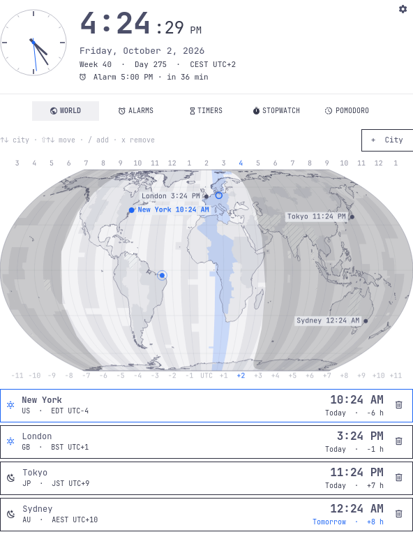
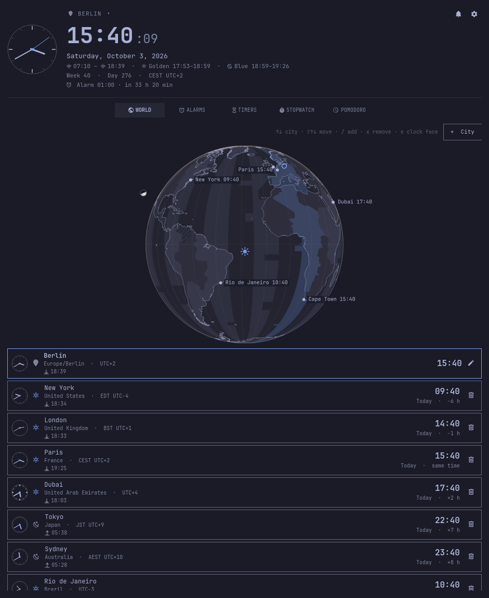
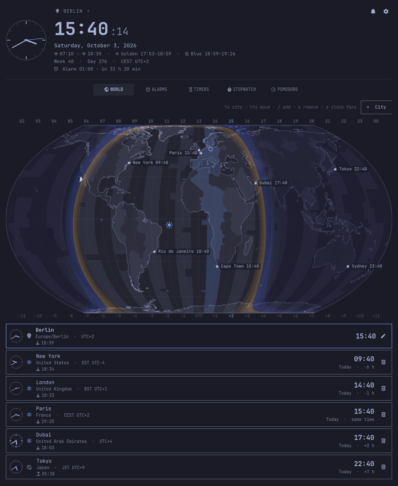
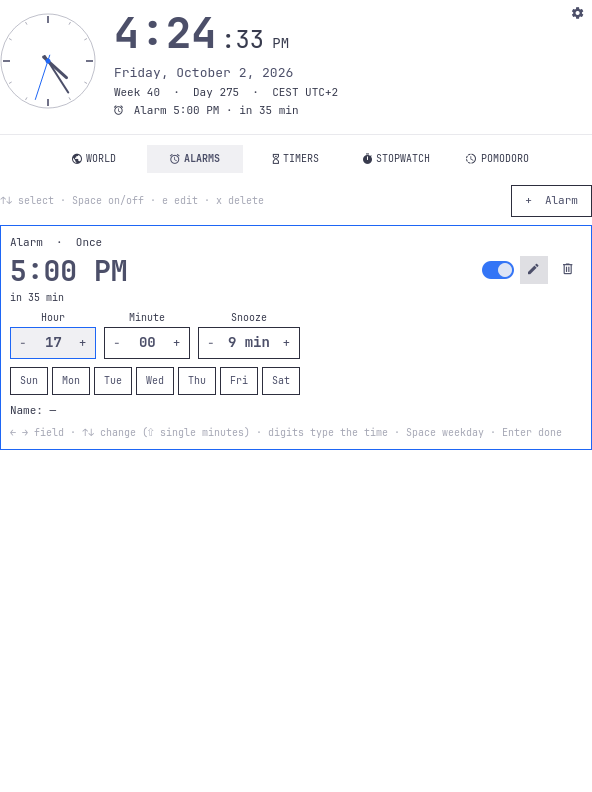
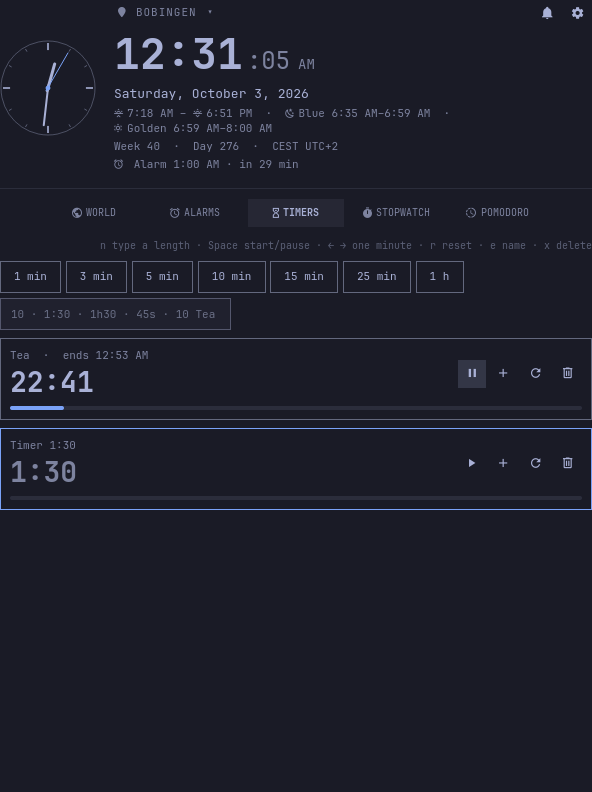
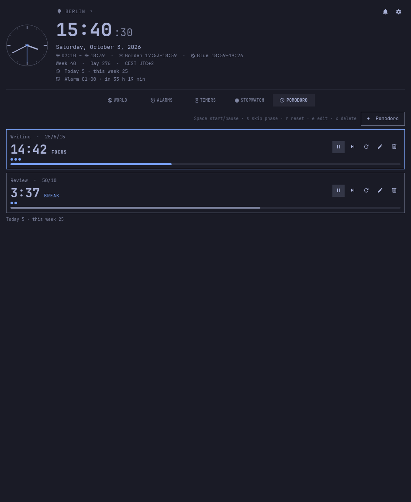
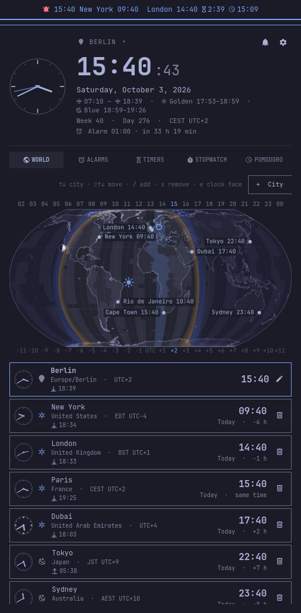
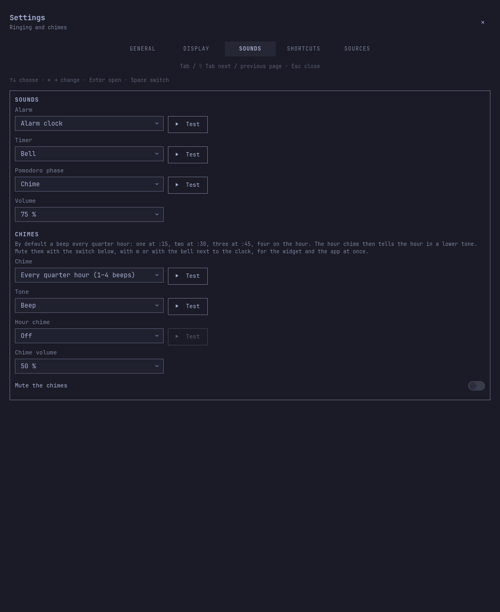

# More Time

A clock plugin for the [Omarchy](https://omarchy.org) bar with a world clock on
a map of the time zones, alarms, timers, stopwatches and pomodoros, as many of
each as you like. The same view also runs as a standalone app window. It works
the way [More Weather](https://github.com/T-The-Coder/more-weather) does: the same
popup, settings, hover entries in the bar, 30 languages and full keyboard
control.



## Features

**In the bar**
- The time, and whatever else you choose: seconds, weekday, date, week number,
  the time in your first cities, the next alarm, a running timer, stopwatch or
  pomodoro, today's and this week's pomodoro rounds, and a blinking bell while
  something rings.
- Every entry shows **always**, **when relevant**, or on **hover**:
  - "Relevant" means the next alarm within 12 hours, timers, stopwatches and
    pomodoros while they run, and the bell while something rings.
  - By default the seconds and two cities appear while the pointer rests on the
    clock.
- The text turns **bold** at once while the pointer is on the clock (switch
  **Bold while hovered**), and the popup can open on hover.
- **Colour the values** (off, while hovered, always; while hovered by
  default): the time in the colour of the sky where you are (day, golden hour,
  blue hour, night, drifting with the sun's elevation; the place is Omarchy's
  weather location, else your time zone's city), running timers and pomodoros
  in the accent colour and red in their
  last minute (paused ones and pomodoro breaks muted), a running stopwatch in
  the accent colour, the next alarm in the accent colour within an hour and red
  within ten minutes, each city in the accent colour by day (6 to 18 there) and
  muted at night, the seconds and the week number muted.
- Left click opens or closes the popup.
- Middle click stops what rings, or else starts or pauses the first pomodoro.
- Right click sends a notification with what is coming up.
- On a vertical bar the clock stacks hours over minutes.

**In the popup and the app**
- **Clock:** the current place's name, its time large with seconds, an
  optional clock face, the date, ISO week, day of the year, its time zone,
  sunrise and sunset with the golden hour (sun between +6° and −4°) and the
  blue hour (−4° to −8°), the morning's before noon and the evening's after,
  and the next alarm. In the popup a click on the time opens the app; the
  buttons in the corner mute the chimes (shown while a chime is set up) and
  open the app and the settings.
- **Current place:** here, or one of your cities, like More Weather's "My
  places". The row above the time shows it: the location pin goes back to here, the name
  and ▾ open the World tab. With a city current, a line keeps the time here in
  view. `Alt 0` is here, `Alt 1`–`9` a city, `Alt ← →` go round, from any tab.
  The bar and the app show the same place, and it is kept across restarts.
  Alarms, chimes and the menu bar always stay on this computer's clock.
- **Here:** Omarchy's weather location if it has one; otherwise, only with
  **Detect my location** on (Settings → General, off by default), your
  approximate place from an IP geolocation service (ipwho.is, then ipapi.co,
  then GeoJS, as More Weather asks them), kept for six hours and asked again
  when the network changes; otherwise the city of your time zone. Its zone is
  always this computer's.
- **World:**
  - A minimalist map in the Equal Earth projection, which is equal-area and much
    less distorted than Mercator.
  - The real time zone borders, drawn as zebra stripes, alternating light and
    dark by the hour. Half- and quarter-hour zones (India, Nepal, Newfoundland …)
    are hatched, and your own zone is in the accent colour.
  - The night side in three steps, each darker: civil twilight (sun 0° to
    −6°), nautical (−6° to −12°), then astronomical twilight and night, in a
    blue-black shade that also shows on dark themes. The Sun's zenith point
    is a small rayed sun. With the clock's golden and blue hour options on, a
    gold band on the day side of the day/night line (sun +6° to 0°) and a
    blue one on the night side (0° to −8°): the gold strongest at the line
    and fading towards the day, the blue light at the line and deepening
    towards the night.
  - A ruler with the hour in every zone above the map and the offsets below it.
  - Your cities as dots with their time.
  - Hovering a zone names its offset and time.
  - Or, instead of the flat map, a globe with the same zones, land, night side,
    golden and blue hour and cities: picking a city (or here) turns it there
    the short way round, a drag or the sideways wheel (⇧ wheel) turns it by
    hand, the vertical wheel scrolls the tab, and if you like it turns by
    itself after 5, 10 or 30 seconds without a touch, one turn in 1, 2, 4
    (default) or 8 minutes (only while you can see it; a click, drag or the wheel stops it,
    the pointer merely resting on it does not, and the tooltips keep working).
  - The globe fills the window: as large as the visible height below it
    allows (the popup's up to its full height), at most the page's width and
    never smaller than 240 points (below that the page scrolls); it grows and
    shrinks as you resize the window. The flat map keeps its proportions and
    narrows, centred, when it would not fit the visible height.
  - Optionally the Moon on the map and the globe, where it stands at the
    zenith right now: a small shaded sphere floating above its shadow, its
    phase lit towards the Sun (the same phase numbers as More Weather);
    hovering it names the phase ("Moon · 61 % · waxing"). Display → Moon
    switches it to "As seen from here": the phase as you see it in the sky
    from the current place (here or the selected city), lit on the right
    while waxing and on the left while waning, mirrored south of the
    equator.
  - Below the map, your place (the location pin and its name, as in More
    Weather) and the city list: time, day/night, today, tomorrow
    or yesterday, and the difference to here, all from the system's time zone
    database, summer time included. Per row, as More Weather's menu bar
    entries do it, the sunrise, the sunset and the next of the two with a
    drawn arrow, in that place's local time (today's, or tomorrow's sunrise
    once today's are over, "—" in polar day or night); the next one is on in
    the app, the others off.
    The selected row is the current place.
  - A clock face per place in one of five styles: classic, minimal, roman,
    24 hours (one turn a day, 00 at the bottom, the night part shaded from
    that place's sunset to sunrise) and dots. The clock on top shows the
    current place's; with **Clock faces in the list** (on in the app) each row
    shows its own small one. Settings → Display → Clock → **Clock face style**
    sets one style for the clock on top instead ("Same as the place" by
    default). `e` or the pencil on the selected row (any row) opens a
    chooser under it (`← →` or a click picks, `Enter` / `Esc` close). The style
    is kept per city in the cities file and for here in `more-time-place.json`.
  - Cities can be found offline from the zone list, or anywhere through the
    place search shared with More Weather: Open-Meteo's geocoder while you
    type; `Enter` on a place it does not know asks Nominatim (OpenStreetMap)
    once, at most once a second, and the next `Enter` adds what it found.
    Nominatim names no time zone: such a place takes the zone of the nearest
    zone-list city, marked "≈".
  - The search works with the keys as in More Weather: `↑ ↓` within the
    results or the cities, `Tab` between them, `Enter` adds the result or
    makes the city current; in the cities (after `Tab`) `+` adds the marked
    result and `−` removes the marked city (twice), while among the results
    they are typed like any character ("Saint-Denis"); `Esc` closes.
  - **Settings → General → Places → Import places from More Weather** adds
    More Weather's saved places as cities, in their order, skipping those
    already here. Each gets the zone of a search for its name (when the
    first result lies within 25 km), else the nearest zone-list city's.
- **Alarms:**
  - As many as you like, each with a time, the weekdays it repeats on (none: once),
    a name and its own snooze length.
  - Optionally at a city's time: the editor's **Place** picks here or a city of
    the World tab, and the alarm rings at that time there, summer time
    included (from the zone's own changes). The card shows both, e.g.
    "7:00 Tokyo · 12:00 AM here"; a zone this computer does not know is
    marked.
  - The bar rings them with the popup closed. An alarm missed while the laptop was
    asleep still rings if it is at most ten minutes late; an older one leaves a
    "missed" notification.
- **Timers:**
  - As many as you like, from presets (1, 3, 5, 10, 15, 25 and 60 minutes to
    begin with; Settings → General → Timers takes your own list) or typed: `10`,
    `1:30`, `1h30`, `45s`. A name can follow the length: `10 Tea` starts a
    ten-minute timer called Tea.
  - Each can be paused, given a minute more or less, reset and named (`e`), and
    shows its progress and end time.
- **Stopwatches:** as many as you like, with hundredths and laps; the fastest
  lap is marked in the accent colour, the slowest in red.
- **Pomodoros:**
  - As many as you like, each with its own focus and break lengths (25/5 to begin
    with).
  - An optional long break every few rounds.
  - Whether the next phase starts by itself.
  - Skipping a phase.
  - A dot for each finished round, and a tally of focus rounds: today and this
    week under the list, optionally in the clock and in the bar. The items file
    keeps the count per day for 60 days.
- **Astro:** the solar system as a clock (on in the app, off in the widget).
  - The Sun and the eight planets where they stand now, from JPL's
    approximate Keplerian elements, computed on this computer and redrawn
    every minute. Distances are drawn as r^0.45 (Mercury to Neptune fit in
    about 1:7); every orbit keeps its true shape and tilt. The planets are
    small shaded spheres lit from the Sun, in restrained tints, with their
    names where there is room.
  - Seen at a slant from above the ecliptic: a drag turns and tilts the view
    (10° to 80° above the ecliptic), the sideways wheel (⇧ wheel) turns it,
    `Ctrl` + wheel or `+` `−` switch between the whole system, the inner
    system and Earth's neighbourhood, `0` returns to the start. Like the
    globe it can turn by itself after a few idle seconds. The far halves of
    the orbits are fainter.
  - The month ring around Earth's orbit: the months' starts and initials, the
    equinoxes and solstices in the accent colour, and a line from the Sun
    through Earth as the hand of the year; a dashed arrow (γ) points to the
    vernal point.
  - The pointer on a body (or a click, which keeps it) shows its distance
    from the Sun and from Earth in au and light-minutes and its orbital
    period.
  - Settings → Display → Astro: orbits, names, the month ring, turning by
    itself (delay and speed).
- **Ringing:**
  - Sound through PipeWire (`pw-play`), chosen per kind from the freedesktop
    sounds, with a volume setting.
  - A notification with **Stop** and **Snooze** buttons.
  - A banner in the popup and the app; Space stops, `s` snoozes.
  - Nothing is lost to a reboot or a logout: the time of the last check is
    kept on disk, so an alarm that came due while the computer was off is
    reported as missed at the next start, and a once-alarm is switched off
    instead of ringing a day late.
- **Chimes:**
  - A short beep on the clock: every quarter hour by default (one beep at :15,
    two at :30, three at :45, four on the hour), or every minute, every hour,
    once a day at a chosen hour, every *N* minutes (1 to 1440; up to 60 counted
    from each full hour, longer intervals from midnight), or off.
  - An optional hour chime tells the hour in a lower tone after the interval
    beeps, on a 12- or 24-hour dial (midnight is 12 or 24 beeps).
  - Five tones to choose from: beep, bell, wood, chirp and glass, each with
    the hour tone a fifth lower. Its own volume, and test buttons.
  - Mute with the switch in the settings, `m`, the bell in the clock's corner or
    IPC; muting applies to the bar, the widget and the app at once. Nothing
    chimes while something rings, and a chime missed by more than 15 seconds
    (suspend) is skipped, not caught up. While muted, the right-click
    notification says so.
  - The tones are synthesized once on this computer (`data/chime-tones.py`);
    only one instance plays them, like the alarms.

**Everywhere**
- Everything keeps running with the popup closed and across restarts: running
  things are stored as moments (when a timer ends, when a stopwatch started),
  not as counters.
- **Settings** (`Ctrl ,` or the gear):
  - **General:** language (automatic or one of 30), 24 or 12 hours, the
    position in the bar, the snooze length, the timer presets, detecting
    your location, the lengths of new pomodoros, the app launcher entry, and
    export and import of everything.
  - **Display:** separately for the menu bar, the widget and the app.
    - Menu bar: which entries show, when, and in what order; bold while
      hovered; coloured values; open the widget on hover.
    - Widget and app: what the clock shows (sunrise and sunset on in the app,
      off in the widget; golden and blue hour off), which tabs there are, their
      order and the tab on opening; for the World tab the map style (flat map
      or globe), the night side, the ruler (flat map), city names, the Moon
      (lit as from space or as seen from here) and whether the globe turns by
      itself.
  - **Sounds:** the sound for alarms, timers and pomodoro phases and their
    volume; the chimes (interval, tone, hour chime, volume, mute).
  - **Shortcuts:** every key and click, listed.
  - **Sources:** where times, places and the map come from.
- 30 languages, right to left included.
- Full keyboard control, settings included (see below), and an IPC interface.

## Screenshots

| Berlin with the globe, golden and blue hour, the cities' clock faces | The flat map: hour ruler, three-step night, the sun | Alarms: one at Tokyo's time, the editor open |
|---|---|---|
|  |  |  |

| Timers running, one named | Pomodoros: focus, a break, today's tally | Menu bar with coloured values, and the widget |
|---|---|---|
|  |  |  |

| Settings → Sounds: the chimes |
|---|
|  |

## Keyboard

The same keys work in the popup and in the app; Settings → Shortcuts lists them
too.

| Keys | Action |
|---|---|
| **General** | |
| `Esc` | Close the editor, the search or the settings, then the panel |
| `Tab` / `⇧ Tab` | Next / previous bar panel (popup) |
| `Ctrl ,` | Open the settings |
| `1`–`9` | Tabs |
| `o` | Open the app (popup) |
| `m` | Mute / unmute the chimes |
| `Alt 0` | Back to here (current place) |
| `Alt 1`–`9` | City 1 to 9 as the current place |
| `Alt ← →` | Previous / next place: here and the cities |
| `PgUp` / `PgDn` | Scroll a page |
| `Home` / `End` | To the top / bottom |
| **Alarms, timers, stopwatches, pomodoros** | |
| `↑ ↓` / `j k` | Select |
| `⇧ ↑ ↓` / `J K` | Move the selected one |
| `n` / `+` | New |
| `Space` / `Enter` | Start / pause, alarm on / off |
| `e` | Edit (alarm, pomodoro), or the name (timer, stopwatch) |
| `r` | Reset |
| `x` / `Del` | Delete (press twice) |
| `l` | Lap (stopwatch) |
| `s` | Skip the phase (pomodoro) |
| `← →` / `h l` | One minute less / more (timer) |
| **While editing** | |
| `← →` / `h l` | Field |
| `↑ ↓` / `j k` | Change the value (minutes in fives) |
| `⇧ ↑ ↓` | Single minutes |
| `0`–`9` | Type the time (`730` → 7:30) |
| `Space` | Weekday on / off |
| `Enter` | Done, or type the name |
| **World** | |
| `/` / `+` | Add a city |
| `↑ ↓` (search) | Move within the results or the saved places |
| `Tab` / `⇧ Tab` (search) | Switch between results and saved places |
| `Enter` (search) | Use the result, or switch to the saved place |
| `+` (search) | In the saved cities (Tab): add the marked result |
| `−` (search) | In the saved cities (Tab): remove the marked city |
| `Esc` (search) | Close the search |
| `← →` / `h l` | Select a place: here or a city (`↑ ↓` / `j k` too) |
| `e` | Clock face style of the selected place (`← →` pick, `Enter` / `Esc` close) |
| `x` / `Del` | Remove the city (press twice) |
| **Astro** | |
| `Ctrl ← →` | Turn the view (also a drag or the sideways wheel) |
| `Ctrl ↑ ↓` | Tilt the view (also a drag up or down) |
| `+` / `−` | Whole system, inner system, Earth (also `Ctrl` + wheel) |
| `0` | Back to the start view |
| **While something rings** | |
| `Space` / `Enter` | Stop |
| `s` | Snooze |
| **Settings** | |
| `Tab` / `⇧ Tab` | Previous / next settings page |
| `1` `2` `3` | Menu bar / widget / app settings (Display) |
| `↑ ↓` / `j k` | Previous / next setting |
| `← →` / `h l` | Change the value or pick the switch column |
| `Space` / `Enter` | Switch, open the list or press the button |
| `⇧ ↑ ↓` / `J K` | Move the entry up / down |
| `PgUp` / `PgDn` | Scroll a page |
| `Esc` | Close the settings |
| **Mouse** | |
| Left click on the clock in the bar | Open / close the widget |
| Left click on the time in the widget | Open the app |
| Middle click on the clock in the bar | Stop ringing, else start / pause the first pomodoro |
| Right click on the clock in the bar | What is coming up, as a notification |
| Click on the pin above the clock | Back to here |
| Click on the place name or ▾ above the clock | The World tab, to pick the place |
| Click on a row in the World list | That place becomes current |

## Data sources

- **Time zones:** the system's tz database. `zdump` gives every offset change for
  the next years, and `zone1970.tab` names a city with coordinates for every zone.
  Nothing is fetched for times.
- **Here:** Omarchy's weather location (`settings/weather.json`, only read);
  with **Detect my location** on and no weather location, IP geolocation
  through [ipwho.is](https://ipwho.is/), [ipapi.co](https://ipapi.co/) or
  [GeoJS](https://www.geojs.io/), which see your IP address; otherwise the city
  of your time zone from `zone1970.tab`. Sunrise, sunset and the twilight are
  computed locally.
- **Place search:** [Open-Meteo geocoding](https://open-meteo.com/en/docs/geocoding-api)
  while typing, for places that are not in the zone list; on `Enter` for a
  place it does not know, [Nominatim](https://nominatim.org/) (OpenStreetMap),
  never from type-ahead and at most once a second, as its usage policy asks.
  Only the typed text is sent.
- **Map:** [Natural Earth](https://www.naturalearthdata.com/) coastlines (1:50m)
  and time zones (1:10m), public domain, projected with
  [Equal Earth](https://equal-earth.com/) and shipped with the plugin
  (`data/worldmap.json`, 170 KB). The zones are standard time; summer time is not
  drawn on the map, but the clocks include it.
- **Solar system:** the planets' Keplerian elements and their rates from JPL's
  [Approximate Positions of the Planets](https://ssd.jpl.nasa.gov/planets/approx_pos.html)
  (E. M. Standish, table 1, valid 1800–2050, about an arcminute), solved on this
  computer (`Astro.js`); nothing is downloaded.
- **Sounds:** the freedesktop sound theme (`/usr/share/sounds/freedesktop`).
  The five chime tones are synthesized once by `python3`
  (`data/chime-tones.py`) into `~/.cache/more-time`; nothing is downloaded.

## Requirements

- Omarchy with the Quattro shell (Omarchy 4).
- `zdump` and the tz database (part of glibc's `tzdata`), `pw-play` (PipeWire),
  `notify-send` and `python3` (for the chime tones), all installed with Omarchy.
- An internet connection only for searching places outside the zone list, and
  for **Detect my location** if you switch it on.

## Installation

```bash
omarchy plugin add https://github.com/T-The-Coder/more-time.git --enable
```

Or install it first and enable it later:

```bash
omarchy plugin add https://github.com/T-The-Coder/more-time.git
omarchy plugin enable more-time
```

More Time goes into the center of the bar. It can stand next to Omarchy's own
clock: set that clock to a date-only format (for example `"format": "ddd d MMM"`
in its entry in `~/.config/omarchy/shell.json`), or remove it.

## Standalone app

Optional. The app shows the same view in a normal window. Open it with `o` in
the popup, a click on the time, the button in its corner, or:

```bash
~/.config/omarchy/plugins/more-time/app/more-time
```

**Settings → General → Show in app launcher** adds a desktop entry and an icon in
your theme's colours, and removes them again when switched off. From a terminal:

```bash
~/.config/omarchy/plugins/more-time/app/more-time --install-desktop-entry
~/.config/omarchy/plugins/more-time/app/more-time --remove-desktop-entry
```

App and bar share alarms, timers, cities and settings. Only one of them rings:
the bar, or the app while no bar is running.

## Updating

```bash
omarchy plugin update more-time
```

See [CHANGELOG.md](CHANGELOG.md) for release notes.

## Removal

1. If you added the app to the launcher, turn **Show in app launcher** off first.
   If you forget, the leftover entry deletes itself the next time you open it.
2. Remove the plugin:

   ```bash
   omarchy plugin remove more-time
   ```

3. Optional: delete the settings, alarms, timers and cities:

   ```bash
   rm -f ~/.local/state/omarchy/settings/more-time-*.json
   ```

## Files

| Path | Content |
|---|---|
| `~/.local/state/omarchy/settings/more-time-general.json` | General settings |
| `~/.local/state/omarchy/settings/more-time-{menubar,widget,app}-display.json` | Display settings per surface |
| `~/.local/state/omarchy/settings/more-time-cities.json` | World clock cities |
| `~/.local/state/omarchy/settings/more-time-place.json` | The current place (`here` or a city), shared by the bar and the app, and here's clock face style |
| `~/.local/state/omarchy/settings/more-weather-locations.json` | More Weather's saved places; only read, by **Import places from More Weather** |
| `~/.local/state/omarchy/settings/more-time-items.json` | Alarms, timers, stopwatches, pomodoros, and the pomodoro rounds per day (60 days) |
| `~/.local/state/omarchy/settings/more-time-ringer.json` | When the last check for due alarms ran and what already rang, so alarms missed while the computer was off are reported after a reboot |
| `~/.local/state/omarchy/settings/more-time-settings-backup.json` | The settings from before the last import |
| `$XDG_RUNTIME_DIR/more-time/runtime.json` | Which instance rings, what rings now and the minute that last chimed (gone after a reboot) |
| `~/.cache/more-time/chime-<tone>-{interval,hour}.wav` | The chime tones, generated on first use of a tone |
| `$XDG_RUNTIME_DIR/more-time-app/` | Temporary app configuration (links to the plugin and the Omarchy shell) |
| `~/.local/state/omarchy/settings/weather.json` | Omarchy's shared weather location; only read: where "here" is (name, sunrise and sunset, the sky colour of the time in the bar) |
| `~/.local/state/omarchy/settings/more-time-here.json` | The place IP geolocation found, with when and on which network, only while **Detect my location** is on (asked again after six hours or on a new network) |
| `~/.config/omarchy/shell.json` | Omarchy's bar layout; changed only through `omarchy-bar move` when you pick a position under Settings → General |
| `~/.local/share/applications/more-time.desktop`, `~/.local/share/more-time/launch`, `~/.local/share/icons/hicolor/scalable/apps/more-time.svg` | App launcher entry, only while **Show in app launcher** is on |

## IPC

```bash
qs ipc -p /usr/share/omarchy/shell call more-time toggle
qs ipc -p /usr/share/omarchy/shell call more-time tab alarms
qs ipc -p /usr/share/omarchy/shell call more-time city 2
qs ipc -p /usr/share/omarchy/shell call more-time nextCity
qs ipc -p /usr/share/omarchy/shell call more-time startTimer 25
qs ipc -p /usr/share/omarchy/shell call more-time stopRinging
qs ipc -p /usr/share/omarchy/shell call more-time toggleChimes
```

| Call | Effect |
|---|---|
| `open`, `close`, `toggle` (`show`, `hide`) | The popup |
| `settings` | Opens the popup with the settings |
| `tab <name>` | Opens the popup on a tab: `world`, `alarms`, `timers`, `stopwatches`, `pomodoros`, `astro` |
| `city <n>` | Opens the popup on the World tab with city *n* (from 1) as the current place |
| `here` | Opens the popup on the World tab with here as the current place |
| `nextCity`, `previousCity` | Opens the popup on the World tab and makes the next / previous place current (here and the cities in turn) |
| `startTimer <minutes>` | Starts a timer |
| `toggleStopwatch`, `togglePomodoro` | Starts or pauses the first one (adds one if there is none) |
| `stopRinging`, `snooze` | Stops everything that rings / snoozes the newest alarm |
| `muteChimes`, `unmuteChimes`, `toggleChimes` | Mutes / unmutes the chimes everywhere |
| `status` | A JSON diagnosis, including `here`, `currentPlace` and `chimes: { interval, tone, hourChime, muted, nextAt }` |

## Development

The time calculations (zone tables, alarms, timers, stopwatches, pomodoros,
chimes), the map projection and data, and the translations have tests for
Node's built-in test runner:

```bash
node --test tests/*.test.mjs
tests/qml-syntax.sh    # every QML file parses (qmllint)
tests/ui-shots.sh      # screenshots of every view, offscreen, with a throwaway HOME
tests/ui-showcase.sh   # the README pictures: cities, alarms, timers, pomodoros, Berlin as here
```

Every `Text` sets `textFormat: Text.PlainText`, so a place name or label
holding HTML is never rendered as rich text; `tests/plain-text.test.mjs`
checks the texts fed by the identifiers in `tests/plain-text-sources.json`.
Texts for `notify-send` go through `Model.notificationText()`.

The texts of the 30 languages live in `i18n/<language>.js`, one file each
(`en.js`, `de.js`, … `zh_TW.js`); `I18n.js` imports them and holds the
lookup. `tests/load.mjs` resolves those imports for the Node tests.

`tools/build-preview.sh <its output directory>` puts `screenshots/` and
`preview.png` together from a showcase run, in the colours of the current
Omarchy theme.

With `MORE_TIME_SOUND_DRY_RUN=1` in the environment, sounds and chimes are
only logged (`pw-play` command lines), never played; the screenshot run uses
it.

The map data is built from Natural Earth with `python3 tools/build-worldmap.py`.
That is only needed when the source data changes; the result is committed.
`python3 tools/build-globe-land.py` then turns its land into
`data/globe-land.json` (latitude and longitude, counter-clockwise rings) for
the tilted globe view.

The sun and the sky (overhead point, elevation, sun times, twilight steps and
colours) live in `Sky.js`, which knows no projection. `EqualEarth.js` holds
the flat map's projection (`project`, `unproject`, `X_MAX`, `Y_MAX`,
`outline`, `graticule`), the flat twilight polygons (`twilightPolygon`,
`nightPolygon`) and `ringToMap`, which puts a ring of `data/globe-land.json`
on the map, cut at ±180° for strokes. `WorldMap.js` keeps the time zones and
the old names as thin wrappers over both. `Moon.js` draws the Moon either way
(`moonLitAngleFor`: from space or as seen from a latitude).
`Globe.js` holds the World tab's globe and, for More Weather's globe, a view
that can tilt to any latitude and zoom (`viewMatrix`, `prepareVectors`,
`prepareLand`, `projectView`, `unprojectView`, `frontPolygonsView`,
`frontLinesView`, `capPolygonView`, `gridLinesView`), working on unit vectors
and joining clipped fills along the rim. Their tests are `tests/sky.test.mjs`,
`tests/equal-earth.test.mjs` and `tests/globe.test.mjs`; `tests/globe-time.test.mjs`
covers the parts that need More Time's flat map data.

The Astro tab is `TimeAstro.qml` over two pure files: `Astro.js` (JPL's
approximate elements, Kepler's equation, heliocentric positions, orbits,
periods and the year's marks: equinoxes, solstices and month starts) and
`AstroView.js` (the r^0.45 model scale, body sizes, the camera, projection,
depth order, zoom steps and hit testing). `tests/astro.test.mjs` checks the
positions against references derived independently (the Sun's longitude from
the Astronomical Almanac's formula, the 2026 seasons, Earth's perihelion, the
Mars opposition of February 2027), `tests/astro-view.test.mjs` the view.

Some files are shared with [More Weather](https://github.com/T-The-Coder/more-weather)
(the switches, buttons, bar placement, app launcher entry, the request helper,
the place search with `PlaceSearch.js` and its test, the Moon with `Moon.js`,
its test and the `MoonSphere` component, `Sky.js`, `EqualEarth.js`, `Globe.js`
and `data/globe-land.json` with their tests, and parts of the test setup). With both repositories side by side,
`tests/shared-files.test.mjs` checks that the copies match, and
`tools/sync-shared.sh from-sibling` or `to-sibling` copies them across with the
names changed.

## License

MIT, see [LICENSE](LICENSE). Map data: Natural Earth, public domain.
